# HTML


lo que hace html es decirle al navegador esto de aquí es un párrafo, esto de aquí es una cita, NO es algo visual para eso esta css.

Nuestro archivo principal debe de llamarse index.html, los demás que no son principales le podemos poner otro nombre con la extensión html.

💡 ***Recuerda: No se trata de como se ve, sino como esta organizado y estructurado el contenido.***

---

## 1. Estructura básica

Para que nos muestre la estructura básica podemos dar:  **! + Tab.**

```html
<!DOCTYPE html>
<html lang="en">
<head>
    <meta charset="UTF-8">
    <meta http-equiv="X-UA-Compatible" content="IE=edge">
    <meta name="viewport" content="width=device-width, initial-scale=1.0">
    <title>Document</title>
</head>
<body>
    
</body>
</html>
```

Esa es la estructura básica de HTML5. Funciona así:

- **!DOCTYPE html:** Con esto le decimos al navegador que estamos usando la versión html5 en la pagina.
- **lang="en":** Indica cuál es el lenguaje en la página. (es) para español.
- **head:** Acá se agrega la información para el navegador, pero esta no se vera en la pagina.
- **body:** Acá se agrega toda la información que el usuario vera.

---

## 2. head

- **meta:** tenemos muchas atributos para esta etiqueta pero estas son las mas importantes por ahora.
    - **meta charset="UTF-8":** Se coloca para que el navegador permita usar tildes, ñ, acentos..
    - **meta name=”description” content=”__”:** es para hacer una breve descripcion de tu pagina. va en content.
        - ***Ejemplo:*** Lo que dice ***“HTML es un lenguaje de marcado que nos…”*** esa es la descripción.
            
            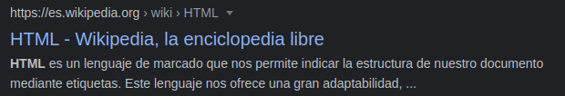
            

- **`<link>`:** esta etiqueta nos permite traer recursos externos a nuestra pagina.
    - `<link rel="icon" href="logohtml.png">`: Este atributo es para poner un icono en nuestra pagina web.
        - ***Ejemplo:*** En este caso el icono es el corazón.
    
    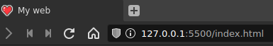
    
    - `<link rel=”stylesheet” href=”style.css”>`: Estos atributos son para conectar nuestra pagina a una hoja de estilos de css.

- **scrip:** Me conecta con java script.
    - primero debemos tener un archivo js.
    - luego ponemos: `<script src="archivo.js"></script>`

- **title** Esta etiqueta es para el titulo de nuestra pagina web.
    
    ***Ejemplo:*** El titulo acá seria My web.
    
    `<title>My web</title>`
    
    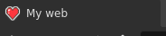
    

---

## 3. body

En body, a las etiquetas de contenido(las que crean contenido) se les dicen elementos.

hay dos tipos:

### elementos de bloque:

ocupan todo el espacio posible horizontal.

- **heading:** son los títulos de nuestra pagina, pero cada uno tiene diferente importancia.
    - **h1** Es para colocar el titulo principal.
    - **h2:** Es un subtitulo de h1.
    - **h3:** Es un subtitulo de h2.
    - **h4 h5 h6** casi nunca se usan.
    
    **!** el ultimo heading es **h6**
    
- **Párrafos:** son bloque de texto.

    `<p>___</p>`: esto crearía un párrafo

    💡***Recurso:Aveces no sabemos bien el contenido de el párrafo y para eso  podemos crear texto en esta pagina [[lorem ipsum](https://www.lipsum.com/)]y pegarlo.***
    
    
- **hr** es para separar un tema de otro. (no solo es una linea)
- **pre** es para poner un bloque de texto pero respeta como lo pongamos.*(se usa mucho para poner código)*
    
    ejemplo:
    
```html
    <p>
    	Lorem ipsum dolor sit amet 
      onsectetur adipisicing elit.
      Reiciendis porro ipsam 
      fugit dolore.
    </p>
    
    <pre>
    	Lorem ipsum dolor sit amet 
    	onsectetur adipisicing elit.
    	Reiciendis porro ipsam 
      ugit dolore
    </pre>
```
    
asi se veria en la página:
    
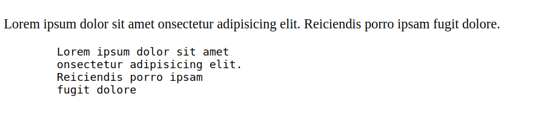
    

como podemos ver `<pre>` respeta como escribamos nuestro contenido.

- **div** es para organizar o agrupar contenido y luego aplicarle estilos con css o js.
    
ejemplo:
    
```html
    <style>
            div{
                color:blueviolet;
            }
        </style>
    </head>
    <body>
            <h1>Mi web</h1>
            
            <div>
            <p>
                Lorem ipsum dolor sit amet 
                onsectetur adipisicing elit.
                Reiciendis porro ipsam 
                fugit dolore.
            </p>
    
            <pre>
                Lorem ipsum dolor sit amet 
                onsectetur adipisicing elit.
                Reiciendis porro ipsam 
                fugit dolore
            </pre>
        </div>
```
    
Como vemos he puesto `<p> y <pre>` dentro de div porque solo quiero darle estilos a esos elementos. los estilos se deben de poner en un archivo de css aparte o en el mismo archivo de html asi como se ve en el head.
    
asi se ve en la pagina web:
    
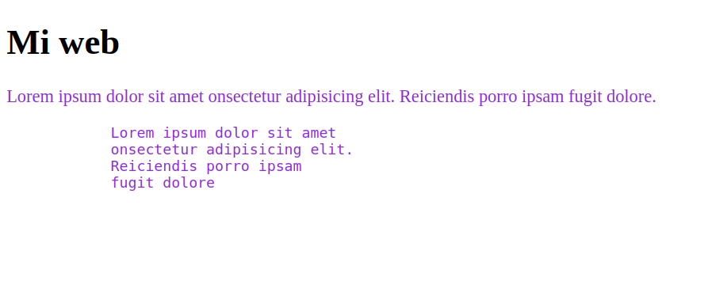
    
- **blockquote:** para poner citas.
- **br:** salto de linea.(solo es una etiqueta de body, no es de ningún tipo).

### Elementos de línea:

se ponen en la misma linea y van dentro de un elemento de bloque.

- **em:** es para poner énfasis de una palabra en lo que estoy diciendo.
- **strong:** es el texto mas importante de todo el párrafo.
- **small:** es para texto menos importante.
- **span:** contenedor de linea, se usa mas en css es como div.
    
ejemplo: pondremos una palabra en azul. En este caso es marianna.
    
en html ponemos: `hola me llamo <span>marianna</span>`
    
ahora con css pondremos:
    
```css
    span{
    	color: blue;
    }
```
    
    y este es el resultado:
    
    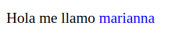
    
- **sub y sup:** es para subindice y el otro para superindice.
- **code:** para escribir una linea de codigo.
- **time:** para colocar horas, se usa mas en un blog o para publicaciones.

---

## 4. Etiquetas de sección

Nos permite estructurar las etiquetas dentro de body.

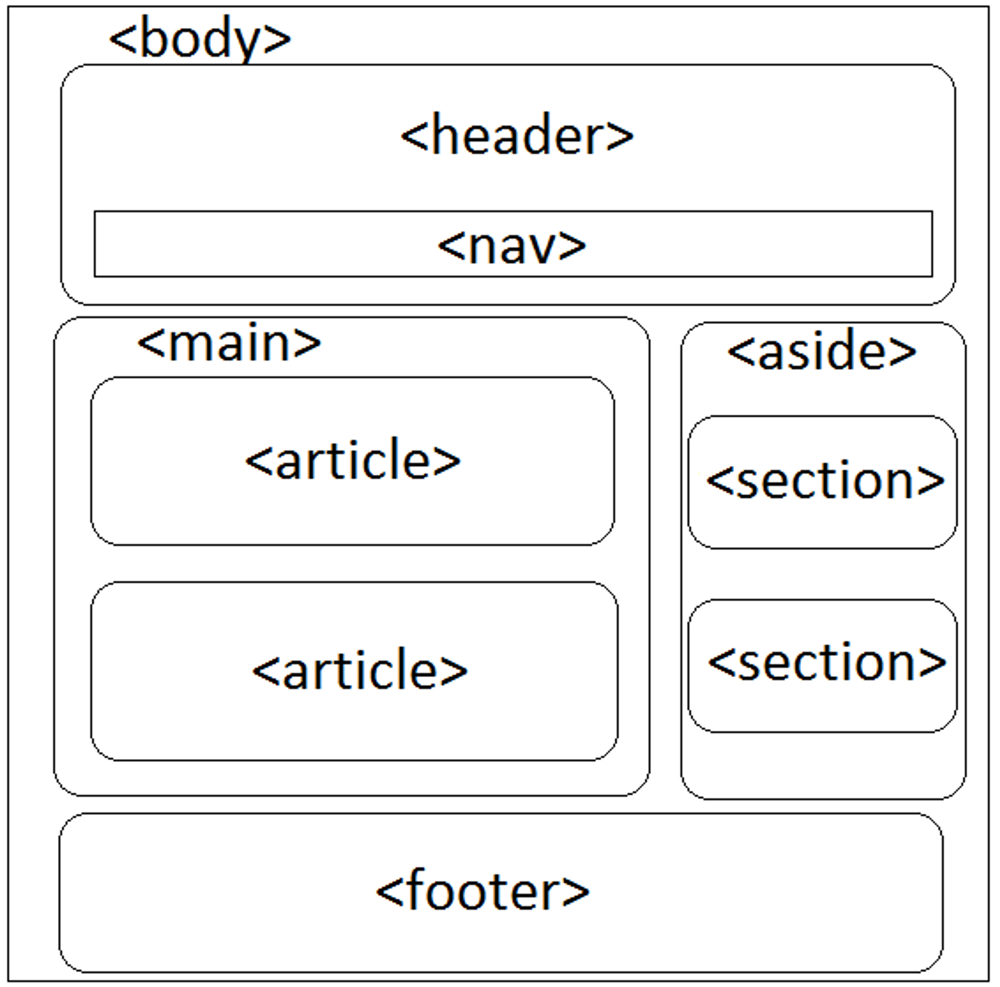

- **header:** Van el titulo, logo de la pagina web.
    
    Ejemplo:
    
    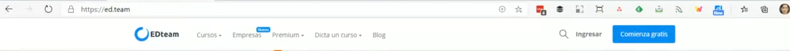
    
- **nav:** Se usa para navegar. Colocar barras de navegación o menú.
- **main:** Va la información principal de la pagina web.
- **article:** como su nombre lo dice es para artículos. Esta etiqueta va dentro del main.
- **aside:** Es para colocar información relacionada pero que no es principal.
- **section:** Es para dividir internamente algo del mismo contenido en secciones.
- **footer:** Podemos poner datos de tu pagina web, es el pie de pagina.
    
    E*jemplo:*
    
    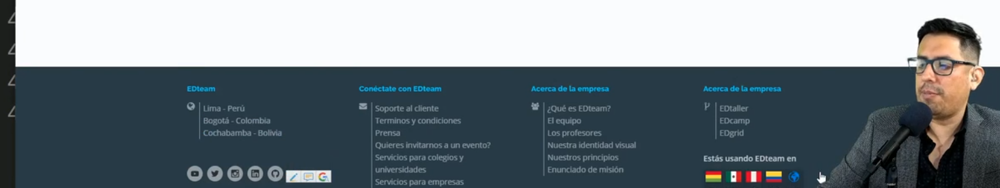
    

### ***Ejemplo:*** en la pagina de edteam.

    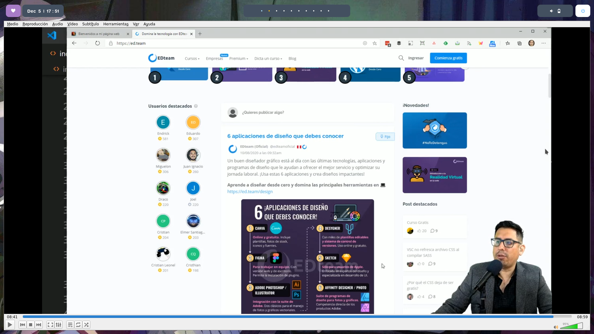

- el `<main>` y `<article>` seria:
    
    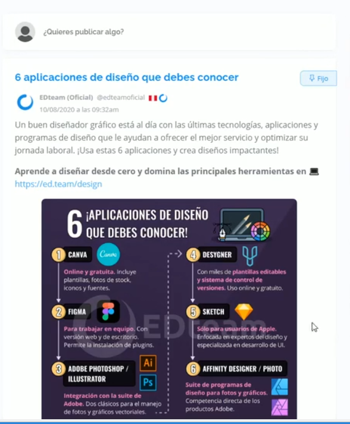
    

- el `<nav>` seria: cursos / empresas / premium …


- el `<aside>` seria:
    
    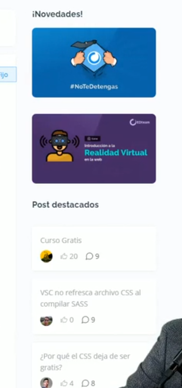
    

---

## 5. Enlaces

es pasar de un documento a otro, por medio de un link.

- **conceptos importantes:**
    - servidor de desarrollo: es local.(podemos usar live server)
    - servidor de producción: es cuando queremos subir nuestra pagina a en un servidor real.
    - rutas absolutas: se usan para rutas externas y tienen protocolo(https,http).
    - rutas relativas: se usan rutas internas, no san protocolo.
    
    ej: img/goku.png
    

`<a href=”https://link.com”>click aca</a>`

### Enlaces externos atributos:

- **href:** es obligatorio ahí ponemos nuestro link.
- **target=”_blank”:** abrir enlace en pestaña nueva.
- **rel=”nofollow”:** no transmite autoridad.
- **rel=”noreference”:** no indica al destino el origen del link.
- **rel=”noopener”:** es para evitar que al abrir otra pestaña(target) puedan inyectar código malicioso.
- **download**: es para que al hacer click no se abra el enlace sino que se descargue pero para eso necesitamos tenerlo localmente osea ya descargado y un servidor.
    
    ejemplo: `<a href=”imagen.jpg” download>Descargar imagen</a>`
    

### Enlaces internos atributos:

un ejemplo que vamos a hacer es un indice, ya que atraves de enlaces nos lleva a alguna parte pero de la misma pagina y crearemos un enlace para devolvernos al indice.

*en nuestro archivo index.html pondremos:*

```html
<p>
<a href="indice.html">Ver el indice</a>
</p>
```

*en nuestro archivo indice.html que creamos pondremos:*

```html
<h2 id="indice">Indice</h2>
<p><a href="#capitulo 1">Capitulo 1</a></p>
<p><a href="#capitulo 2">Capitulo 2</a></p>
<p><a href="#capitulo 3">Capitulo 3</a></p>
<p><a href="#capitulo 4">Capitulo 4</a></p>

<h2 id="capitulo 1">Capitulo 1</h2>

<p>Lorem ipsum dolor sit amet, consectetur adipisicing elit.
 Vitae aliquam tempore aliquid distinctio consectetur in ad
 expedita, quod et asperiores maiores, alias sit similique quasi.
</p>

<p>Lorem ipsum dolor sit amet, consectetur adipisicing elit.
 Vitae aliquam tempore aliquid distinctio consectetur in ad
 expedita, quod et asperiores maiores, alias sit similique quasi.</p>

<p><a href="#indice">Regresar al indice</a></p>

<h2 id="capitulo 2">Capitulo 2</h2>

<p>Lorem ipsum dolor sit amet, consectetur adipisicing elit.
 Vitae aliquam tempore aliquid distinctio consectetur in ad
 expedita, quod et asperiores maiores, alias sit similique quasi.
</p>

<p>Lorem ipsum dolor sit amet, consectetur adipisicing elit.
 Vitae aliquam tempore aliquid distinctio consectetur in ad
 expedita, quod et asperiores maiores, alias sit similique quasi.
</p>

<p><a href="#indice">Regresar al indice</a></p>

<h2 id="capitulo 3">Capitulo 3</h2>

<p>Lorem ipsum dolor sit amet, consectetur adipisicing elit.
 Vitae aliquam tempore aliquid distinctio consectetur in ad
 expedita, quod et asperiores maiores, alias sit similique quasi.
</p>

<p>Lorem ipsum dolor sit amet, consectetur adipisicing elit.
 Vitae aliquam tempore aliquid distinctio consectetur in ad
 expedita, quod et asperiores maiores, alias sit similique quasi.
</p>

<p><a href="#indice">Regresar al indice</a></p>

<h2 id="capitulo 4">Capitulo 4</h2>

<p>Lorem ipsum dolor sit amet, consectetur adipisicing elit.
 Vitae aliquam tempore aliquid distinctio consectetur in ad
 expedita, quod et asperiores maiores, alias sit similique quasi.
</p>

<p>Lorem ipsum dolor sit amet, consectetur adipisicing elit.
 Vitae aliquam tempore aliquid distinctio consectetur in ad
 expedita, quod et asperiores maiores, alias sit similique quasi.
</p>

<p><a href="#indice">Regresar al indice</a></p>
```

*así se vería en la pagina web:*

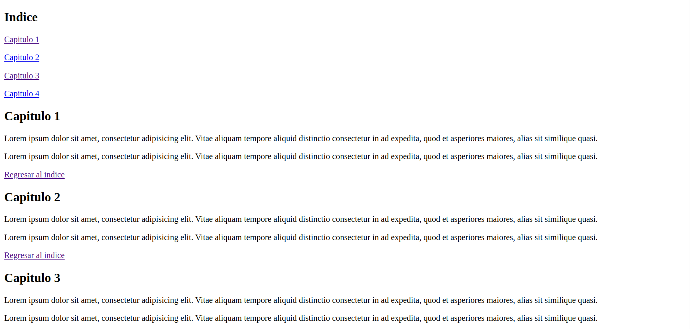

---

## 6. Listas

hay varios tipos de listas, pero las que mas se usan son: las ordenadas y las desordenadas.

### Listas ordenadas (ol)

son las que llevan una secuencia, como los números y las letras.

```html
<h2>cosas por hacer:</h2>
<ol>
	<li>tarea de mate</li>
	<li>comida</li>
	<li>dormir</li>
</ol>
```

> **cosas por hacer:**
> 
> 1. tarea de mate
> 2. comida
> 3. dormir

### Listas desordenadas (ul)

son las que no siguen una secuencia, como asteriscos.

```html
<h2>lista de compras:</h2>
<ol>
	<li>Arroz</li>
	<li>limones</li>
	<li>maduro</li>
</ol>
```

> **lista de compras:**
> 
> - Arroz
> - limones
> - maduro

### Listas anidadas

```html
<ul>
	<li>lunes
		<ol>
			<li>sacar a mara</li>
			<li>comprar mercado</li>
		</ol>
	</li>
	<li>martes
		<ol>
			<li>sacar a mara</li>
			<li>comprar mercado</li>
		</ol>
	</li>
</ul>
```

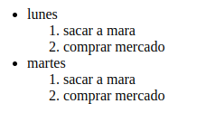

### Listas de definición (dl)

es para definir algo como en los diccionarios o glosarios.

```html
<h2>etiquetas de HTML que debes conocer</h2>
        <dl>
            <dt>HTML</dt>
            <dd>es la raiz del proyecto</dd>
            <dt>HEAD</dt>
            <dd>agrupa los datos importantes para el navegador</dd>
            <dt>BODY</dt>
            <dd>agrupa los datos visibles en la pagina web</dd>
        </dl>

```

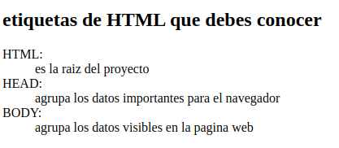

---

## 7. Multimedia

## Imágenes

hay dos tipos de imágenes: en mapa de bits y vectorizadas. Los bits al hacer zoom pierde la calidad y se ven como puntos,se les llaman pixeles y al unirse forman una imagen y los vectores no pierden nitidez al hacerles zoom.

### formatos:

- **vectores:**
    - **.svg:** es la que menos pesa y es mejor para logos porque no se ven los puntos como en png.


💡 *hay mas extensiones de figma,adobe xd… pero no son aceptadas por el navegador)*


- **bits:**
    - **.jpg/.jpeg:** pesan menos que png y son mas para fotos.
    - **.png:** pesan mas que las .jpg y jpeg, son mas para fotos o imágenes detallas con transparencia.
    - **.gif:** para animaciones.
    - **.webp:** es mas liviano que png y lo creo google.
    

### como se insertan en html?

- si la imagen no esta una carpeta pondríamos:

``

- si la imagen esta dentro de una carpeta pondríamos:

``

- si la imagen es un enlace pondríamos:

``


💡 *Recomendación: hay un atributo que es **alt=” ”** sirve para describir la imagen. También sirve para que el navegador encuentre mas rápido la imagen o para darle accesibilidad a un usuario que no pueda ver bien o no vea.*


💡 *Se puede ajustar la imagen con 2 atributos, pero no es una buena practica ya que cuando sepamos css es mejor no usar esos atributos de html sino con css editar la imagen. Son width (ancho) y height (altura), es mejor colocar solo uno porque la imagen se puede deformar se recomienda width. **ej: widt=”200”**.*


### imagen responsive

es una imagen ****que se adapta a las características de los distintos dispositivos. Es importante hacerlas bien, porque mejoran el rendimiento y la experiencia del usuario en la pagina web.

- ***srcset***
    
    podemos darle distintas opciones de imagen en función de la resolución del dispositivo y el navegador elige la que mas se adapte.
    
    ***ejemplo:***
    
    ```html
    
    ```
    
- **sizes**
    
    nos permite definir condiciones más precisas que tiene que seguir el navegador para elegir que imagen mostrar. De esta forma la decisión ya no la toma el navegador por si mismo, si no que podemos nosotros forzar cierto condicionamiento.
    
    ejemplo:
    
    ```html
    
    ```
    
- **picture**
    
    Es moderna y lo soportan todos los navegadores principales.
    
    ```html
    <picture>
    	<source srcset="" media="(max-width:1200px)">
    	
    </picture>
    ```
    
    ejemplo:
    
    ```html
    <picture>
    	<source srcset="
    	img/mobile.webp, img/mobile.jpg" media="(max-width:1200px)">
    	
    </picture>
    ```
    

## Audio y vídeo

es muy sencillo usar esta etiqueta hay dos formas con un archivo descargado o externo osea de youtube o otra plataforma.

- Descargado:
    - video:
    
    ```html
    <video 
    src=”video/nombre.mp4” 
    width=”500”
    controls
    poster="img/nombre.jpg"
    autoplay
    muted>
    </video>
    ```
    
    - src””: es para poner el vídeo, pero aparecerá como imagen.
    - controls: es para colocar los controles de reproducción, volumen.. y así ya no veremos una imagen.
    - poster=””: es para colocar una imagen principal y ya luego al darle reproducir se muestre el vídeo.
    - autoplay: es para que se reproduzca solo.
- audio: es igual solo que sin la funcion poster.
    
    `<audio src="audio/nombre.mp3"></audio>`
    
    - externo
    
    es muy sencillo por ejemplo para insertar un vídeo de youtube:
    
    1. buscamos el vídeo.
    2. luego le damos donde dice compartir.
    3. luego donde dice incorporar <>
    4. y ya solo copiamos el código y lo pegamos.
    
    también podemos insertar publicaciones de redes sociales y muchas mas cosas.
    
    
    💡 *se recomienda usar vídeos y audios externos porque son mas ligeros.*
    
    

---

# 8. Tablas

se usa para organizar información en filas y columnas.

### Estructura

- estructura básica de una tabla:

```html
<table>
	<tr>
		<td></td>
		<td></td>
		<td></td>
		<td></td>
	</tr>
</table>
```

- estructura completa de una tabla:

```html
<table>
	<tr>
		<th></th>
		<th></th>
	</tr>

	<tr>
		<td></td>
		<td></td>
	</tr>
</table>    
```

### Etiquetas

- `<caption>`: en esa etiqueta va el titulo de la tabla.
- `<thead>`: dentro de esta etiqueta va la cabecera .
- `<tbody>`: dentro de esta etiqueta va el contenido.
- `<tfoot>`: en esta etiqueta va el pie de la tabla, osea la conclusión como un total.

- `<th>`: para la cabecera
- `<tr>`: para las filas.
- `<td>`: para cada celda.

## Otros

- **extenciones de vsc:**
    - live server.
    - dracula: tema.
    
- **links de paginas web de vectoriales gratis sin derecho de autor.**
    - [https://unsplash.com/](https://unsplash.com/)
    - [https://www.flaticon.com/](https://www.flaticon.com/)
    - [https://iconscout.com/](https://iconscout.com/)
    - [https://undraw.co/](https://undraw.co/)
    - [https://www.humaaans.com/](https://www.humaaans.com/)